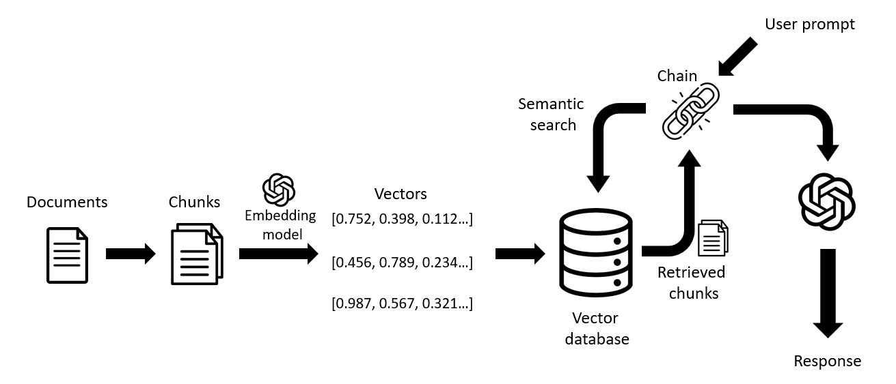

# Enhancing Recommendation Systems with Large Language Models (RAG - LangChain - OpenAI)

This project implements RAG using OpenAI's embedding models and LangChain's Python library. The aim is to make a recommendation system designed to analyze and process a dataset of anime, which includes various attributes such as titles, genres, and synopses.
Domain areas include:
- Embeddings (OpenAIEmbeddings)
- Vector database (lancedb)
- Semantic search types
- Retrieval chain

According to recent studies, large language models (LLMs) have shown great potential for improving recommender systems in various aspects, such as:
- LLMs can act as zero-shot rankers for recommentation systems, using their general-purpose task-solving abilities and self-attention mechanisms to rank items based on user preferences and interaction histories.
- LLMs can leverage their high-quality representations of textual features and their extensive coverage of external knowledge to enhance the recommendation quality and diversity.
- LLMs can generate natural language explanations for recommendations with a conversational interface, using their natural language generation capabilities and their ability to incorporate user feedback and contextual information.

All the above make those models adaptable to different scenarios, from cold start to content-based recommendations.

### References:
1. [Recommendation Systems Enhanced By llms medium](https://medium.com/microsoftazure/recommendation-systems-enhanced-by-llms-fe1fc8e23a58) 
2. [Large Language Models are Zero-Shot Rankers for Recommender Systems](https://arxiv.org/abs/2305.08845)
3. [Anime Recommendation Database 2020](https://www.kaggle.com/datasets/hernan4444/anime-recommendation-database-2020?resource=download&select=anime_with_synopsis.csv)
